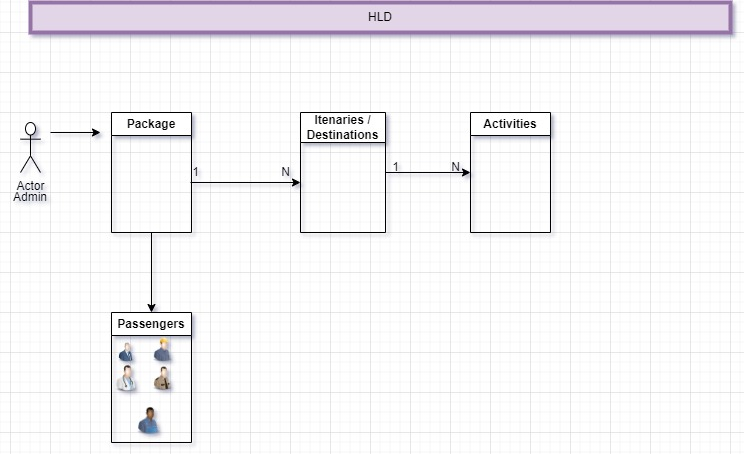
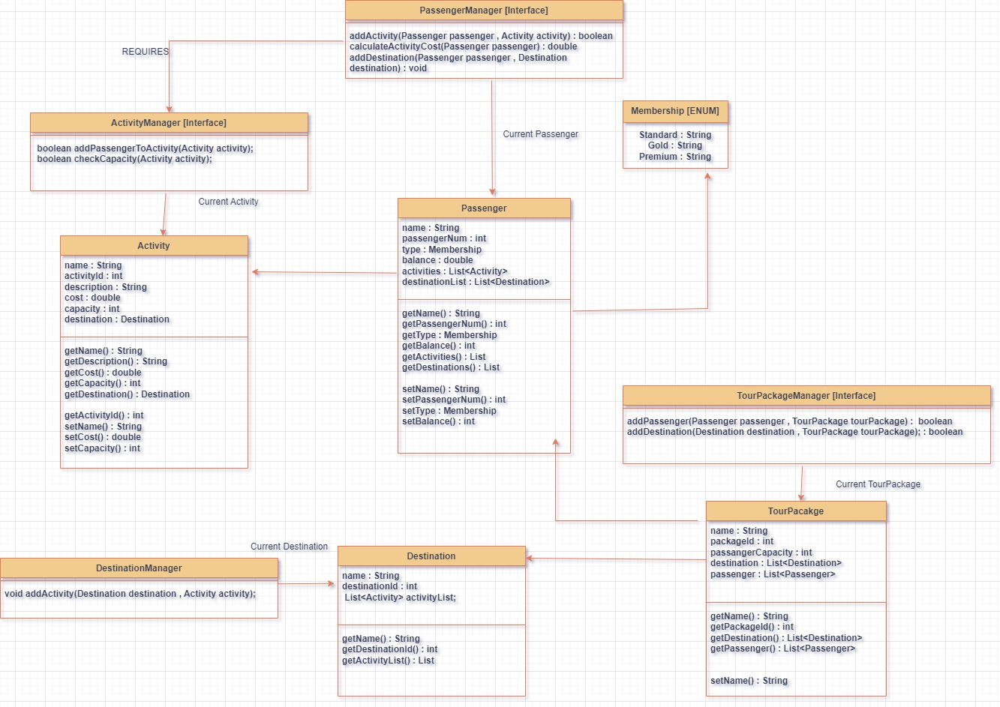

# Travel Agency Manager

## Description
Travel Agency Manager is a Backend System for managing 
various components of ternary , activities, passenger information, tour information etc.

The Application currently runs on static data stored in App.java class 
to demonstrate the following  functionalities of the application.
1. Print itinerary of the travel package including:
   1. travel package name,
   2. destinations and details of the activities available at each destination, like name, cost, capacity and description.
2. Print the passenger list of the travel package including:
   1. package name,
   2. passenger capacity,
   3. number of passengers currently enrolled and
   4. name and number of each passenger
3. Print the details of an individual passenger including their
   1. name,
   2. passenger number,
   3. balance (if applicable),
   4. list of each activity they have signed up for, including the destination the at which the activity is taking place and the price the passenger paid for the activity.

 
4. Print the details of all the activities that still have spaces available, including how many spaces are available.

This application can be later modified to either take user input
   or act as a server for external components.
### Block Diagram

### Low Level Diagram


#### Pre Requisites to Run the Application
1. Java 11

#### Steps to Run the Application 
#### Using Dockerfile  
1. ```docker build -t travel-agency-backend .```
2. ```docker run travel-agency-backend```
* Note : This might take a few minutes running for the first time as it would download the dependencies from Maven Central.

#### Without Using Dockerfile
1. Clone the repository
2. Enter the repository through shell
3. run the following command
   1. ```mvn clean install```
   2. ```cd target```
   3. ```java -jar Assignment-1.0-SNAPSHOT.jar```


